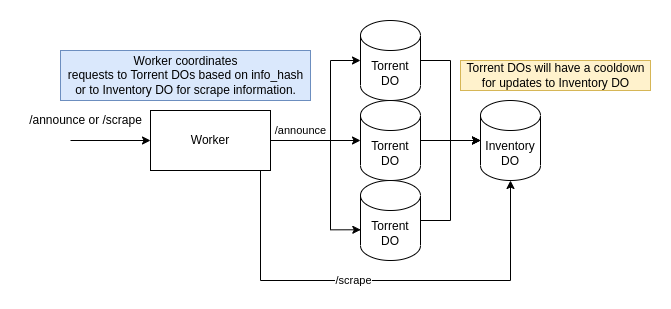

# edge-tracker
A serverless BitTorrent HTTPS tracker built on Cloudflare Workers and Durable Objects.

BitTorrent [Tracker HTTP/HTTPS Protocol](https://wiki.theory.org/index.php/BitTorrentSpecification#Tracker_HTTP.2FHTTPS_Protocol)

Durable Objects are used to store the state of each torrent and its peers. This limits the announce throughput to around 100rps.

`GET /announce?info_hash=...` is the announce endpoint for clients.

`GET /scrape?info_hash=....` is the scrape endpoint for clients

`GET /_peers?info_hash=...` is a debug endpoint that returns the peer state for a metainfo file.

`GET /_purge?info_hash=...` is a debug endpoint that removes all registered peers for a metainfo file.

### TODO
- [x] remove old peers that didn't disconnect properly (based on last seen timestamp)
- [x] select random list of active peers to reply with
- [ ] handle compact peers response
- [ ] use DO to store inventory of torrents and response to `/scrape`

### Architecture

